# Desplegar Aplicación Web de Node.js con CloudantDB

> Presentación [Introducción a Cloud Foundry](https://ibm.box.com/v/cloud-foundry-ppt)

En este tutorial se va a desarrollar un ejemplo para aprender como correr, modificar e implementar una aplicación con una base de datos Cloudant en la nube. Se explorarán dos metodos diferentes para lograrlo, y una vez sean finalizadas, la aplicación será accesible desde internet. 

Despues de teminar este pattern usted entenderá como: 

* Usar el CLI de IBM Cloud
* Crear un servicio en IBM Cloud
* Usar un Toolchain para CI/CD

## Componentes Incluidos

* [IBM Cloud - Cloud Foundry](https://cloud.ibm.com/cloudfoundry/overview): Ejecuta código en una plataforma como servicio (PaaS) en un ambiente stateless y altamente escalable.
* [IBM Cloud - DevOps](https://cloud.ibm.com/devops/getting-started): Herramientas de integración para realizar despliegues continuos.
* [Cloudant](https://cloud.ibm.com/catalog/services/cloudant): Una base de datos No-SQL completamente manejada diseñada para aplicaciones web y mobile modernas que usan documentos como JSON.

# Prerequisitos

* Cuenta activa de [IBM Cloud](https://cloud.ibm.com)
* [IBM Cloud CLI](https://cloud.ibm.com/docs/cli/reference/ibmcloud?topic=cloud-cli-install-ibmcloud-cli#install_use): CLI para desplegar servicios y aplicaciones desde la terminal.

# Paso a Paso

### 1. Clonar el repo

Descarga o clona el repositorio `nodejs-cloudant` localmente. 
En una terminal, puedes ejecutar:

```
$ git clone https://github.com/libardolara/nodejs-cloudant
```

### 2. Login en IBM Cloud

*	Inicia una terminal y **posiciónate en la carpeta raíz del repositorio**, allí debes encontrar los archivos `package.json` y `manifest.yml`
*	Inicia sesión en IBM Cloud según la región que desees usando CLI, para ello utiliza uno de los siguientes comandos y sigue las instrucciones: 

```
$ ibmcloud login
```
> Sigue las instrucciones interactivas del CLI

Si deseas cambiar la región puedes usar alguna de los siguientes comandos:

```
$ ibmcloud login -a https://api.ng.bluemix.net            // US South
$ ibmcloud login -a https://api.us-east.bluemix.net       // US East
$ ibmcloud login -a https://api.eu-gb.bluemix.net         // UK
$ ibmcloud login -a https://api.eu-de.bluemix.net         // Germany
$ ibmcloud login -a https://api.au-syd.bluemix.net        // Sydney
```
> Donde `-a`indica que se va a seleccionar una región de API específica.

*	Observa el resultado del proceso anterior, tu organización y espacio están vacíos. Para configurar la organización y espacio que deseas usar en Cloud Foundry debes ejecutar el siguiente comando.

```
$ ibmcloud target -–cf
```
> Selecciona usando los menús, la organización y espacio que deseas utilizar.

Si deseas cambiar de Organización y de espacio puedes usar el comando

```
$ ibmcloud target -o <organization name> -s <spacename>
```

### 3. Crear el servicio Cloudant Database

* Crea el servicio [**Cloudant**](https://cloud.ibm.com/catalog/services/cloudant) escogiendo `Use both legacy credentials and IAM` para la opción _Available authentication method_. 
* Copia el nombre del servicio.
* Para que desde cualquier aplicación en la organización y espacio de Cloud Foundry se pueda utilizar la base de datos debes crear un Alias para tu servicio de **Cloudant**. Para esto debes ejecutar el siguiente comando:

```
$ ibmcloud resource service-alias-create <nombre-del-alias> --instance-name <nombre-del-servicio>
```
> \<nombre-del-alias\> es el nombre del alias a utilizar dentro de la aplicación de Cloud Foundry

>	\<nombre-del-servicio\> es el nombre de la base de datos creada al principio de este numeral.

### 4. Desplegar la aplicación usando el CLI

*	En la carpeta raíz del proyecto, edita el archivo manifest.yml según necesites. 
* Es imporante cambiar el `name` por un nombre **unico** ya que un subdominio sera asignado con este nombre.
* En el campo `service` cambia el nombre del servicio por el **nombre del alias creado** en el punto anterior.
* Sube la aplicación a IBM Cloud, teniendo en cuenta dicho archivo, mediante: 

```
$ ibmcloud app push 
```

*	Ahora puedes acceder mediante la [interfaz Web](https://cloud.ibm.com/resources), a la vista general de la nueva aplicación y notar como tiene las configuraciones que le especificaste en el `manifest` están aplicadas.
> Para más información sobre las posibilidades de manejo del archivo [manifest](https://docs.cloudfoundry.org/devguide/deploy-apps/manifest.html)

### 5. Auto-scaling en Cloud Foundry

Auto-scaling es una funcionalidad soportada para Cloud Foundry basada en el proyecto Open-source [App-Autoscaler](https://github.com/cloudfoundry/app-autoscaler) y permite ajustar automaticamente la cantidad de instancias de la aplicación que se encuentran desplegada a través de metricas operacionales o periodos de tiempo

* En la interfaz web de la vista general de tu aplicación, haz click en el menú de la izquierda **Autoscaling**
* En la nueva pestaña de policy, haz click en el botón **Create Auto-scaling policy**

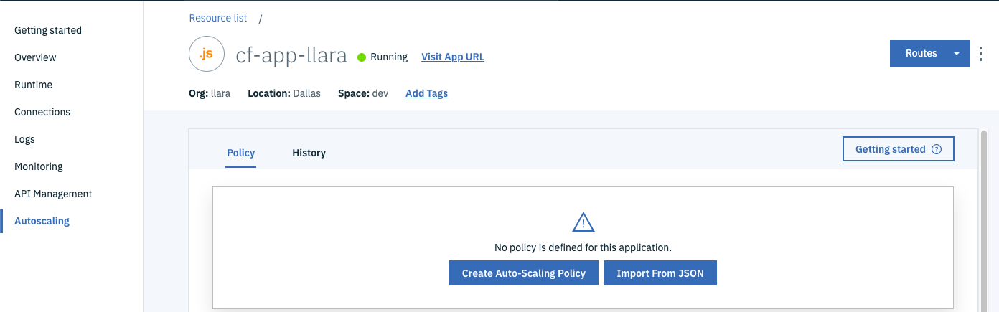

* Define los minimos y maximos en numeros de instancias para tu aplicación. Por ejemplo minimo 1 y maximo 3.
* En las reglas de escalamiento (Scaling Rules) vamos a definir cuando y como escala la aplicación.

```
Existen tipos de metricas que puedes usar en estas reglas dinamicas de escalamiento:

Memory used, representa el valor absoluto de la memoria utilizada de su aplicación. 
La unidad de unidad de utilización de memoria es "MB".

Memory utilization, es la memoria utilizada de la memoria total asignada a la aplicación en porcentaje. 
Por ejemplo, si el uso de memoria de la aplicación es de 100 MB y la cuota de memoria es de 200 MB, 
el valor de memory utlization es del 50%.

CPU , es el porcentaje de CPU utilizado por la aplicación. La unidad de la CPU es "%".

Response time representa el tiempo promedio que tarda la aplicación en responder a una 
solicitud en un período de tiempo determinado. La unidad de tiempo es "ms" (milisegundos).

Throughput es el número total de solicitudes procesadas en un período de tiempo determinado. 
La unidad de rendimiento es "rps" (solicitudes por segundo).

```

* Define una regla que agregue una instancia cuando el **Memory utilization** sea mayor o igual al 70% por 120 segundos con un periodo de espera entre escalamientos de 120 segundos
* Define otra regla que agregue una instancia cuando el **Response time** sea mayor o igual a 40ms por 120 segundos con un periodo de espera entre escalamientos de 120 segundos

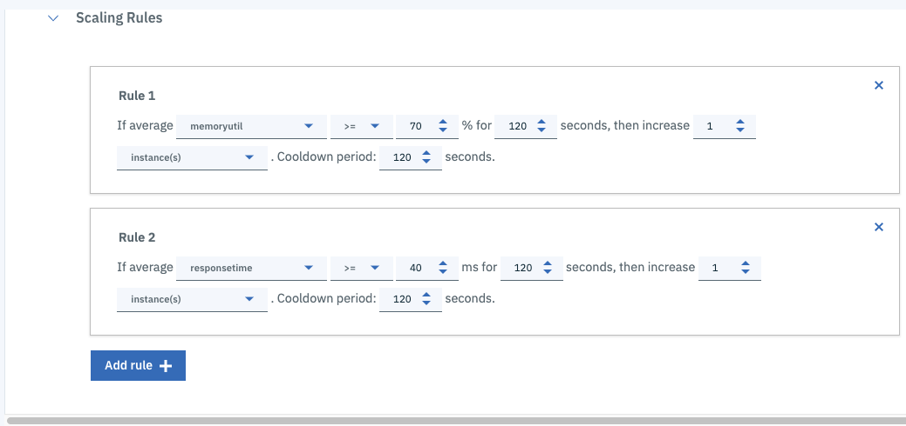

* Añade una regla de horario (Schedule) en donde de lunes a viernes, en horario de oficina se incrementen el minimo de instancias a 2 y el maximo a 10.

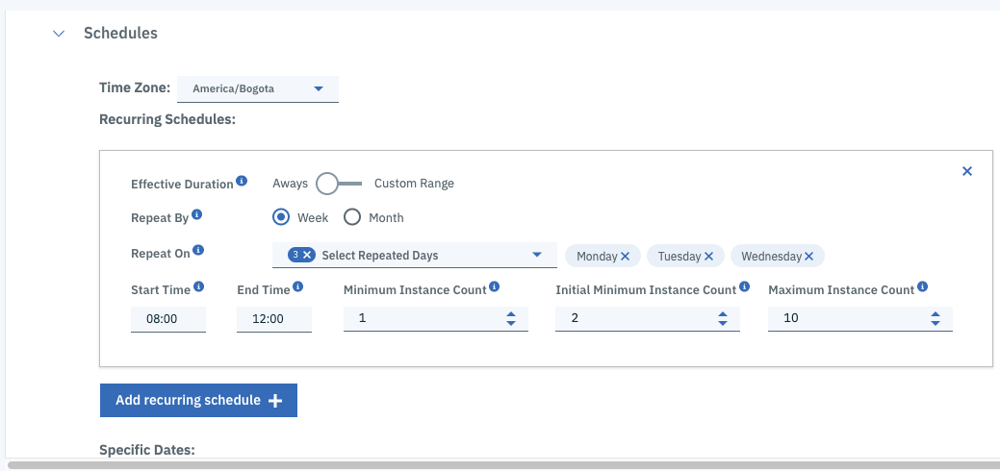

* Finalmente haz click en el botón **Save** (Se encuentra en la parte superior de las politicas de auto-scaling)
* Abre la aplicación
* En la sección de Autoscaling, ve a la pestaña de **Metrics**, observa como se ha comportado la aplicación.

> Parece que la regla de **Response Time** estaba mal dimensionada, por lo cual la vamos a corregir.

* Modifica la regla de **Response Time** para que incremente cuando el tiempo de respuesta sea mayor a 400ms. Recuerda siempre guardar los cambios a las reglas.
* Crea dos reglas para disminur el nuemero de instancias, usando el operador **<**(Menor que)

> Para mayor información sobre la funcionalidad de autoscaling para Cloud Foundry puedes revisar la [documentación](https://cloud.ibm.com/docs/cloud-foundry-public?topic=cloud-foundry-public-autoscale_cloud_foundry_apps)

> Antes de avanzar al siguiente punto de este taller, asegurate que la aplicación con la que venimos trabajando tenga solo una instancia.

### 6. Desplegar la aplicación usando un Toolchain
Ahora vamos a desplegar la misma aplicación pero utilizando la herammienta de despliegue continuo e integración continua de IBM Cloud, llamadas **Toolchains**

* Ve al [catalogo de IBM Cloud](https://cloud.ibm.com/catalog?search=cloud%20foundry) y busca el servicio para Cloud Foundry
* Haz click en el servicio Cloud Foundry.
* Haz click en el botón **Create** para una aplicación publica.
* Selecciona el runtime para Node.Js
*	Configura tu aplicación según tus preferencias, teniendo en cuenta que su nombre debe ser **único** dentro de IBM Cloud, y hacer click en crear con el plan predeterminado. 

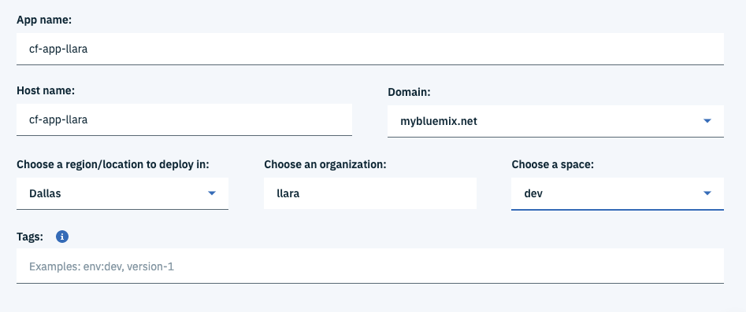

> Recuerda que la región y el espacio que seleccionados permiten la segmentación lógica de las aplicaciones, así que no los olvides.
*	Ahora selecciona en el menú lateral _visión general_ (o Overview) de tu aplicación, allí puedes observar y modificar la configuración y servicios que tiene tu aplicación.
* En la sección de **Entrega Continua** elige habilitar. En este caso buscamos usar un código fuente ya creado en GitHub usando una cadena de entrega continua.

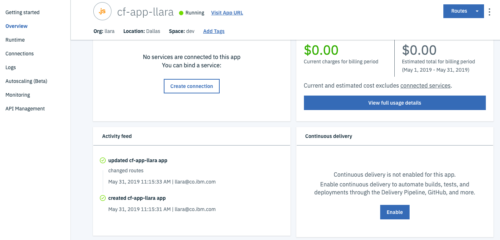

* En la sección integraciones de herramientas selecciona la pestaña “Git Repos y Isue tracking”, y Clona el repositorio:
https://github.com/libardolara/nodejs-cloudant

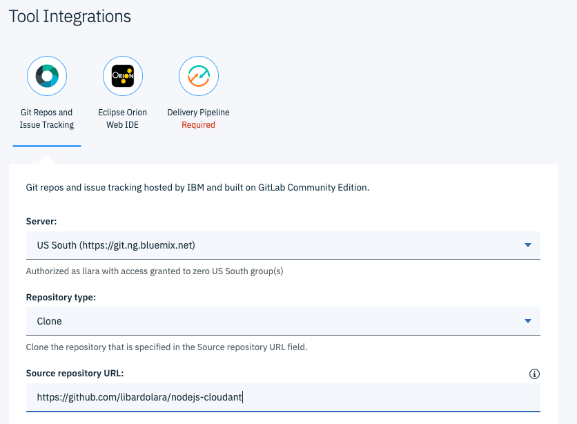

* En la pestaña de “Delivery Pipeline” crea la llave de seguridad para la seguridad de nuestro ToolChain
* Haz click en Create para crear el Toolchain

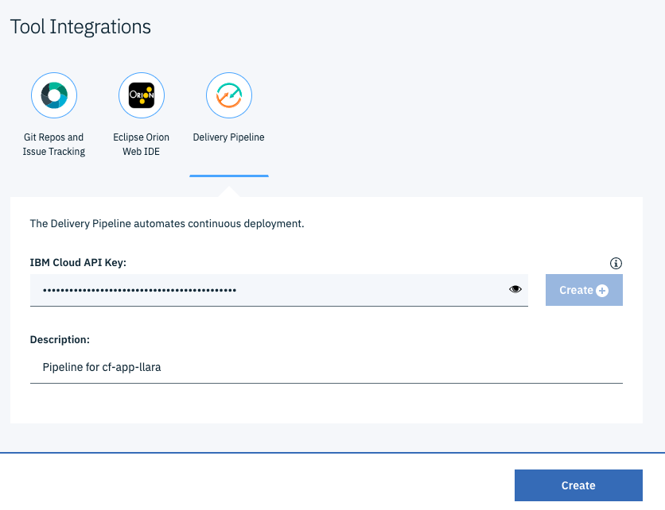

> Recuerda como estaba configurado el archivo manifest del repositorio original, es muy importante que cambiemos el manifest dentro del Git que acabamos de clonar en IBM Cloud

* Dentro del ToolChain haz click en la etapa de Git

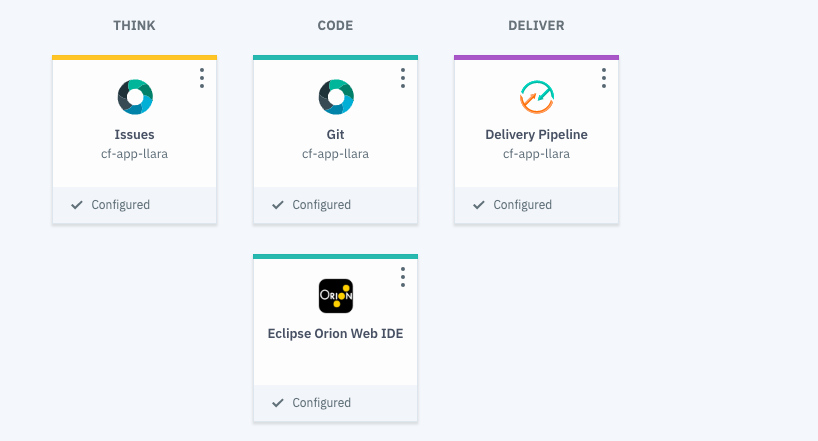

* Navega hacia abajo hasta encontrar el archivo `manifest.yml`, haz click en `manifest.yml`
* Haz click en editar y copia y pega el contendio del manifest que tienes en tu computador para que queden iguales. 

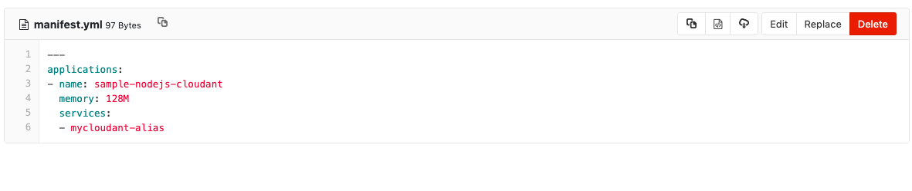

* Haz click en “Commit changes”
* Regresando a la cadena de entrega continua, selecciona Delivery Pipeline y encontraras que se ha ejecutado automáticamente, ya que se genero un nuevo commit en Git con los cambios al manifest.

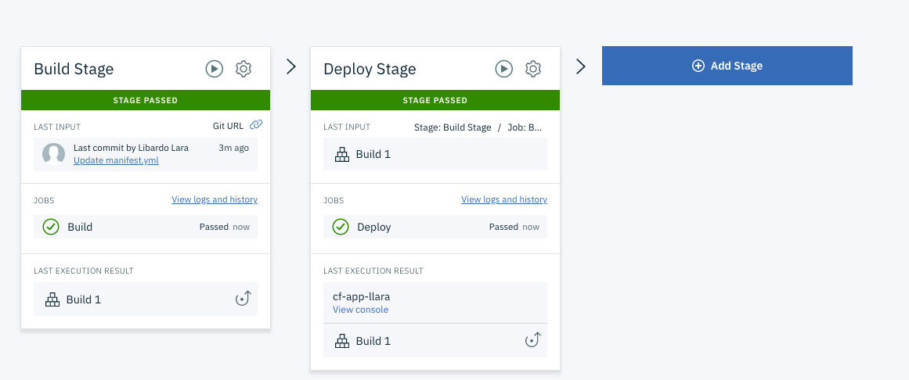

Cloud Foundry soporta muchas tecnicas de despliegue, una muy util es el **Blue Green Deployment**
> Sigue los siguientes pasos para configurar el Blue-Green Deployment en tu Toolchain

* Modifica en el Delivery Pipeline en el Stage “Deploy”. Para esto haz click en la rueda en la esquina del stage.

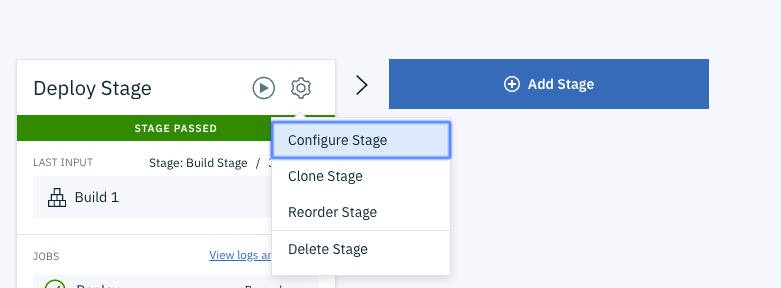

* Copia y pega el contendo del archivo [blue-green.txt](blue-green.txt) en el campo “Deploy Script” y guarde.

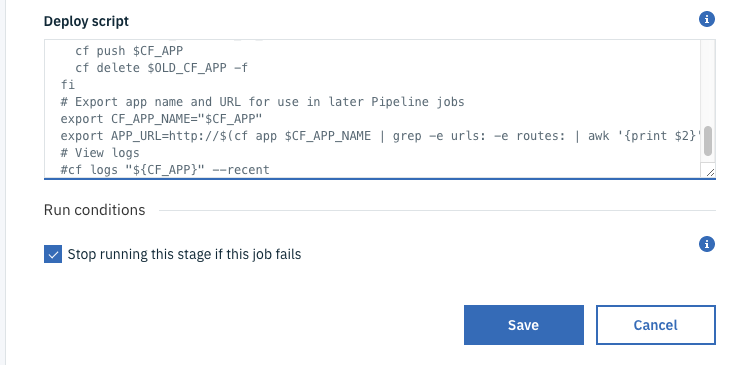

Ahora el Toolchain correrá usando la estrategia de deploy “Blue-Green deployment” la cual asegura que el servicio siempre estará corriendo aun cuando se hacen despliegues en caliente.

### 7. Desplegar automaticamente

Haz click:
[](https://cloud.ibm.com/devops/setup/deploy?repository=https://github.com/libardolara/nodejs-cloudant)


## Links de interés:
*	ToolChain más información: [Toolchain Getting Started](https://cloud.ibm.com/docs/services/ContinuousDelivery/toolchains_working.html#toolchains_getting_started)
*	Documentación de Cloud Foundry: https://docs.cloudfoundry.org/ 
*	Documentación de IBM Cloud: https://cloud.ibm.com/docs 
